# Overview

This investigation analyzes a Windows memory dump to identify signs of compromise, detect malicious processes, and determine the scope of a potential attack using Volatility 3.

# Methodology

·       Memory analysis using Volatility 3 

·       Process enumeration and hierarchy analysis (pslist, pstree) 

·       Command-line investigation (cmdline) 

·       User identification using SIDs (getsids) 

·       Threat intelligence correlation using VirusTotal 

# Analysis

Initial analysis was performed using the command:

python3 vol.py -f "192-Reveal.dmp" windows.pslist

The results did not reveal any abnormal or suspicious processes.

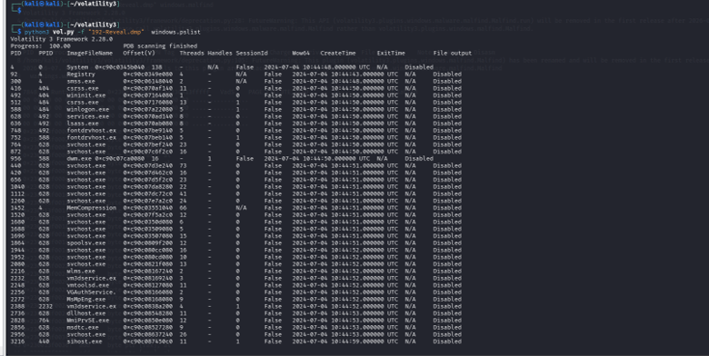

Further analysis was conducted using the following command to examine the process hierarchy:python3 vol.py -f "192-Reveal.dmp" windows.pstree

This approach provided a clearer view of parent-child process relationships, facilitating the identification of any potentially suspicious processes.

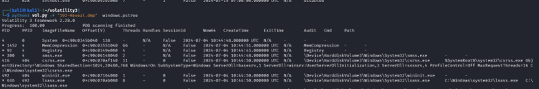

A PowerShell process (powershell.exe) was identified during the analysis.Although the executable path appeared legitimate, further inspection indicated malicious behavior. The process was executed with hidden window parameters ("-windowstyle hidden") and attempted to establish a connection to a remote directory on an external network associated with a suspicious IP address.

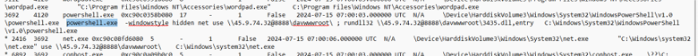

The malicious process had a parent process ID (PPID) of 4120, suggesting a structured attack chain.

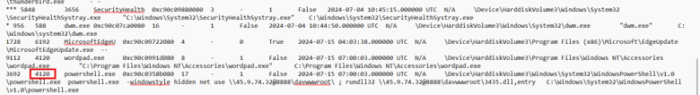

Command:

python3 vol.py -f "192-Reveal.dmp" windows.cmdline

The cmdline plugin was used to retrieve the command-line arguments associated with each process, providing deeper insight into process execution and behavior.

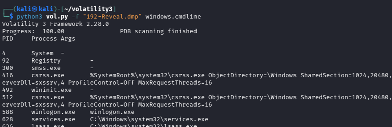

Command-line analysis revealed the execution of a second-stage payload:File: 3435.dll

The attacker accessed a remote shared directory: davwwwroot

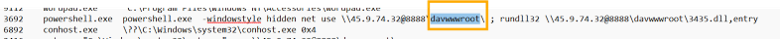

Command:python3 vol.py -f "192-Reveal.dmp" windows.getsids --pid 3692

The getsids plugin was utilized to retrieve the Security Identifier (SID) and corresponding user account linked to the process, enabling attribution of the activity to a specific user context.The malicious activity was executed under the user account:Elon

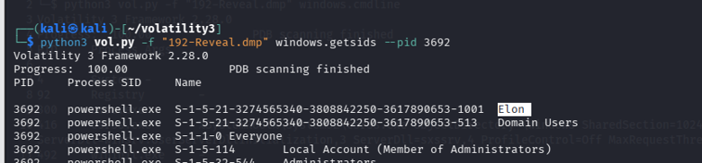

VirusTotal was used to perform threat intelligence analysis and validate the findings.

The investigation revealed a PowerShell-based attack that executed a second-stage payload from a remote shared directory, associated with the Strelastealer malware family.

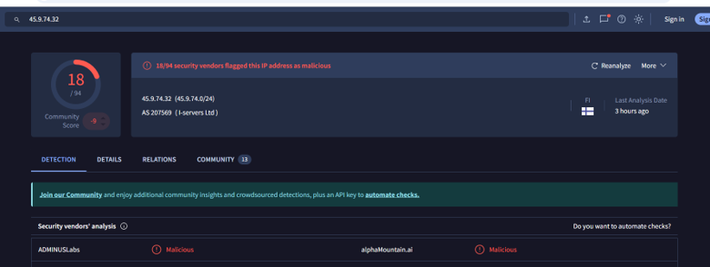  

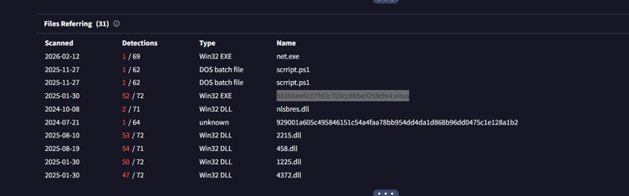  

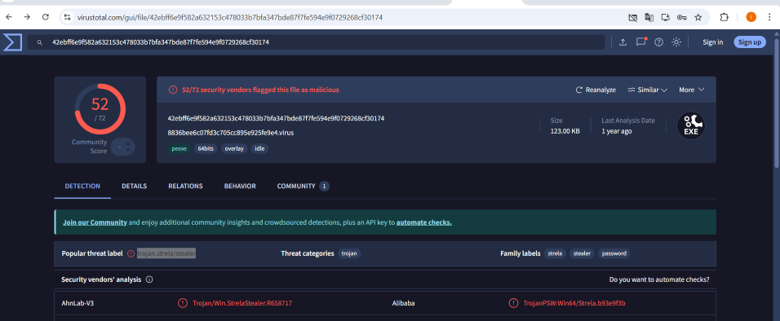

The attack technique aligns with MITRE ATT&CK T1218.011, indicating the use of legitimate system utilities to execute malicious payloads.

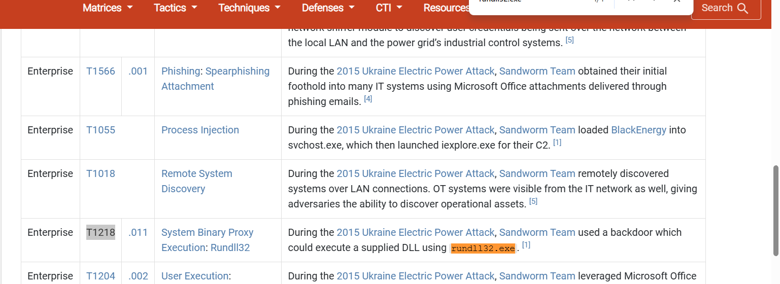

# Findings:

·       Malicious Process: powershell.exe 

·       Hidden execution (-windowstyle hidden) 

·       Payload: 3435.dll 

·       Remote Directory: davwwwroot 

·       User: Elon 

·       Malware Family: Strelastealer 

·       Technique: MITRE T1218.011 

# Conclusion

The investigation revealed a multi-stage PowerShell-based attack that executed a remote payload, indicating a system compromise associated with the Strelastealer malware family.
